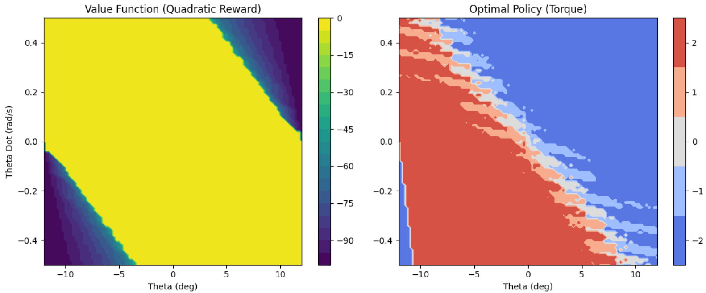
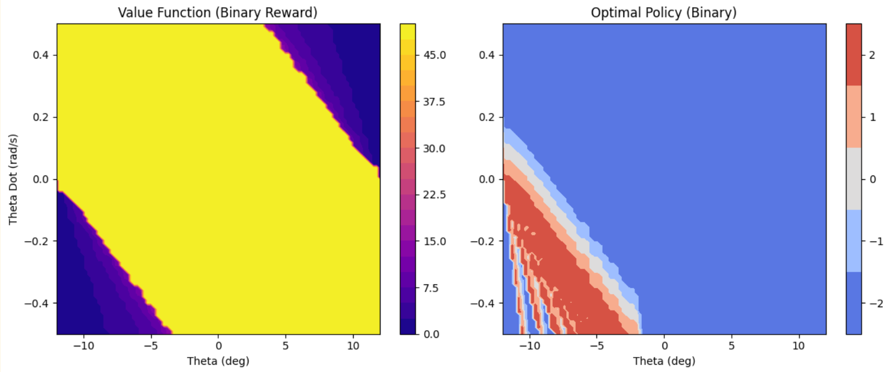

Of course. Here are two separate, detailed README files for the Inverted Pendulum and Cart-Pole tasks.

---

## Inverted Pendulum Control with Value Iteration & CUDA

### Overview

This project implements and solves the classic Inverted Pendulum control problem using **Value Iteration**, a foundational algorithm in dynamic programming and reinforcement learning. The primary goal is to find an optimal policy that applies torque to keep a pendulum balanced upright.

To handle the computationally intensive nature of Value Iteration on a continuous state space, we employ two key techniques:
1.  **State Space Discretization:** The continuous state variables—angle ($\theta$) and angular velocity ($\dot{\theta}$) — are discretized into a fine grid (100x100 levels).
2.  **GPU Acceleration:** The core iterative Bellman update across all 10,000 states is parallelized and executed on the GPU using **Numba's CUDA JIT compiler**, leading to a significant speedup.

The project explores and contrasts two different reward formulations: a smooth **Quadratic reward** and a sparse **Binary (survival) reward**.

### Algorithm and Process

1.  **Environment Modeling**: An `InvertedPendulumEnv` class simulates the physics of the pendulum based on the equation of motion: $ml^2\ddot{\theta} = mgl\sin(\theta) - k\dot{\theta} + u$. It handles state updates and reward calculation.

2.  **Discretization**: The state space is defined by $\theta \in [-12^\circ, 12^\circ]$ and $\dot{\theta} \in [-0.5, 0.5]$ rad/s. This space is discretized into a `100x100` grid. A 2D array, the **Value Function** `V[i, j]`, stores the expected long-term reward for each discrete state.

3.  **Value Iteration with CUDA**:
    *   A CUDA kernel (`value_iteration_kernel`) is defined to perform one step of the Bellman update for a single state.
    *   The main solver launches this kernel in a 2D grid, assigning one GPU thread to each of the 10,000 states. This allows the value of every state to be updated simultaneously in one parallel step.
    *   The kernel calculates the next state (`s'`) for each possible action, computes the immediate reward (`R`), looks up the value of the next state (`V(s')`) from the previous iteration, and updates the current state's value according to the Bellman equation:
        $$ V_{k+1}(s) = \max_a \left[ R(s,a) + \gamma V_k(s') \right] $$
    *   This process is repeated for hundreds of iterations until the Value Function converges.

4.  **Policy Extraction & Evaluation**:
    *   Once the optimal Value Function is found, the optimal **Policy** is extracted by choosing the action that maximizes the Bellman equation at each state.
    *   The performance of this policy is evaluated by running 100 simulations from random initial states and reporting the average time the pendulum remains balanced.

### Results

#### Part (a): Quadratic Reward

The quadratic reward function, $r = -(\theta^2 + 0.1 \dot{\theta}^2)$, penalizes any deviation from the upright position. This "shaped" reward provides a dense gradient that guides the algorithm to a highly stable and smooth control policy.

*   **Convergence:** Converged rapidly in **150 iterations**.
*   **Average Duration:** The policy successfully balanced the pendulum for an average of **25.05 seconds**.

**Value Function and Optimal Policy (Quadratic)**
*(The value function forms a smooth "bowl," indicating a preference for the (0,0) state. The policy provides smooth, proportional control.)*

**Demonstration Video (Quadratic Policy)**
*(The video shows the pendulum quickly stabilizing to the upright position and maintaining it smoothly.)*

---

#### Part (b): Binary Reward

The binary reward function, $r=1$ if $|\theta| \le 12^\circ$ and $r=0$ otherwise, only provides a signal at the edge of failure. This sparse reward makes learning more difficult.

*   **Convergence:** Required more iterations to converge: **500 iterations**.
*   **Average Duration:** The resulting policy was unstable, averaging only **1.43 seconds** before failure.

**Value Function and Optimal Policy (Binary)**
*(The value function is a flat "plateau" in the safe region, offering no incentive to stay centered. This leads to a "bang-bang" policy that oscillates wildly.)*

**Demonstration Video (Binary Policy)**
*(The video shows the pendulum oscillating and quickly losing control, as the policy only acts aggressively near the boundaries.)*

### Discussion

The results clearly demonstrate that for the Inverted Pendulum problem, the **Quadratic reward is superior**. Its smooth, dense signal allows the value iteration algorithm to learn an effective and stable regulation policy. The Binary reward's sparsity and discontinuous nature lead to a much slower convergence and a highly unstable "bang-bang" policy that performs poorly.

---
---

